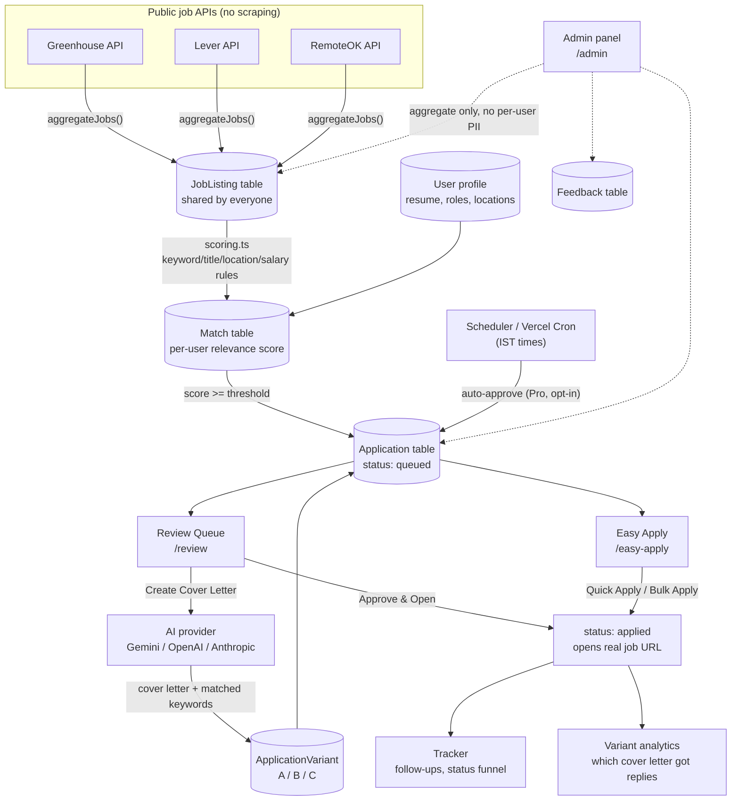

# How Job Pilot Works (Plain-English Guide)

This document explains what happens under the hood, in everyday language — no prior knowledge of the codebase assumed. Each section answers one question: "where does X actually happen?"

---

## 0. End-to-end data flow

Two things worth noticing in that diagram: **`JobListing` is the only shared table** — every other box downstream of it is scoped to one user by `userId`. And **the AI box only ever writes a cover letter**, never touches the actual submission — the arrow from Review Queue / Easy Apply to "applied" is a status change plus opening a real URL, not a form submission.

---

## 1. Where do the jobs come from?

Job Pilot does **not** scrape LinkedIn, Indeed, or any site that forbids it. It only calls **public, official APIs** that companies themselves publish:

| Source | What it is | File |
|---|---|---|
| **Greenhouse** | Many companies use "Greenhouse" software to host their careers page. Greenhouse offers a public API — anyone can ask "show me all of company X's open jobs" without logging in. | [`src/lib/jobSources/greenhouse.ts`](../src/lib/jobSources/greenhouse.ts) |
| **Lever** | Same idea as Greenhouse, different company/software. | [`src/lib/jobSources/lever.ts`](../src/lib/jobSources/lever.ts) |
| **RemoteOK** | A job board that publishes one big public list of remote jobs from many companies at once. | [`src/lib/jobSources/remoteok.ts`](../src/lib/jobSources/remoteok.ts) |

**The catch:** Greenhouse and Lever don't let you ask "show me every job everywhere" — you have to ask company-by-company (e.g. "show me Stripe's jobs," "show me Groww's jobs"). So Job Pilot keeps a list of company names to ask, called **boards**, stored in the `Board` table. As of this writing there are 22 active boards spanning Indian tech (Groww, PhonePe, CRED, Freshworks, Meesho...) and global tech (Stripe, Airbnb, Figma, Databricks, Anthropic, Coinbase, Pinterest, Reddit, Lyft, Block, Affirm, Instacart, Robinhood, Discord...).

**Why not Google/Meta/Amazon/Apple?** They run their own custom in-house hiring systems, not Greenhouse or Lever — there's no public API to ask. This isn't a policy choice, it's a real technical limitation of the aggregation method. Adding them for real would mean either a partnership/paid data feed, or scraping their careers pages directly (against most of their ToS and fragile to redesigns) — a materially different, riskier build than what exists today.

### How does Job Pilot know which companies to ask?

This is **auto-discovery** ([`src/lib/jobSources/discovery.ts`](../src/lib/jobSources/discovery.ts)). Since there's no "list every company" button, Job Pilot instead:

1. Takes a candidate company name (from a curated starter list, or a custom name an **admin** types in).
2. "Knocks on the door" of both Greenhouse's and Lever's APIs for that name — literally just tries the URL and sees if it responds with real job data.
3. If one of them answers, that company gets saved as an active **board**. If neither answers, it's reported as "not found."

Board management (adding/removing/toggling boards) lives in the **Admin panel** (`/admin`) — it's shared infrastructure that affects every user's job pool, so as of this build it's admin-only rather than something every user can mutate.

### Putting it together — a "refresh"

When you click **Refresh jobs** (or the scheduler runs), Job Pilot:
1. Asks every active Greenhouse/Lever board, plus RemoteOK, for their current job list — all at once, in parallel.
2. Saves every listing into one shared `JobListing` table. "Shared" means every user of the app sees the same pool of raw listings — makes sense, since these are public job postings, not private data.
3. If a listing already exists (same company + same job ID), it's updated in place rather than duplicated.

---

## 2. How does it decide which jobs are relevant to *you*?

This is **scoring**, in [`src/lib/scoring.ts`](../src/lib/scoring.ts). It's a plain point system — no AI involved here, just simple rules, so it's fast, predictable, and free to run:

| What it checks | Points | Example |
|---|---|---|
| Does the job title match one of your target roles? | up to 45 | You want "Software Engineer," the job is titled "Senior Software Engineer" → strong match |
| Does the job description mention skills from your resume? | up to 30 | Your resume says "React, TypeScript" and the job description says "React, TypeScript" → points for each overlapping skill |
| Does the location match what you want? | up to 15 | You want "Remote," the job says "Remote (India)" → match |
| Does the seniority level match? | up to 10 | You're looking for "Senior" roles, the job title says "Senior" → match |
| Does the salary meet your floor? | +5 or −10 | You set a ₹20,00,000 floor; a ₹35,00,000 job gets a small bonus, a ₹8,00,000 job gets penalized |

Everything adds up to a score from 0–100. Anything you've listed as an **excluded company** gets a hard 0, no matter what.

Every job also gets a plain-English list of **reasons** (e.g. "Title matches target role", "3 resume keywords in JD") so you can see *why* it scored the way it did — this shows up as little tags on each card in the Review Queue.

Jobs scoring **10 or higher** (the default threshold — lowered from an initial 25 to surface more real matches) get automatically added to your review queue as a new "queued" application.

### Duplicate detection

Aggregators (and even the same company posting to multiple boards) sometimes list the same job twice with slightly different wording. [`src/lib/dedupe.ts`](../src/lib/dedupe.ts) compares company + title using a "how different are these two strings" measure (Levenshtein distance — counts the minimum number of letter changes to turn one string into the other). If a job is 90%+ similar to one you've already acted on, it's skipped instead of cluttering your queue again.

---

## 3. Two ways to apply: Review Queue vs. Easy Apply

**Review Queue** (`/review`) is the deliberate path: one job at a time, full job description, optional AI-generated cover letter, edit before you go.

**Easy Apply** (`/easy-apply`) is the fast lane for volume: a ranked, checkbox-able list of every queued job. Each row has a one-click **⚡ Apply** button (marks applied + opens the job URL, no AI wait), plus a **bulk apply** button to process many at once. There's an optional "also write a cover letter" toggle if you want tailoring without the full review screen — bulk-with-cover-letter is capped at 20 jobs per batch to keep it fast and avoid silently burning a large AI bill in one click.

Both paths write to the exact same `Application` table — Easy Apply isn't a separate system, it's a different UI on the same data.

---

## 4. How does the AI cover letter work?

This is in [`src/lib/ai/tailor.ts`](../src/lib/ai/tailor.ts). As of this build, **AI tailoring only writes a cover letter** — it does not rewrite your resume. (An earlier version also generated tailored resume bullets; that was intentionally removed to keep the feature focused and the AI call cheaper/faster.)

When you click "Create Cover Letter" on a job:

1. Job Pilot sends your chosen AI provider a prompt containing: your master resume (pasted in Profile), the job title, company, and full job description.
2. The model is instructed to **stay grounded in what's actually true** in your resume — never invent skills, employers, or experience you don't have.
3. It sends back:
   - A short, JD-specific cover letter in the tone you picked (e.g. "professional," "enthusiastic," "concise")
   - A list of keywords from the job description that you genuinely have (useful context, shown as chips)
4. You can edit the text before using it — nothing is sent to the employer automatically.

### Bring-your-own AI provider

Profile → "AI provider & API keys" lets you add your own key for **Gemini**, **OpenAI**, or **Anthropic**, with a link to each provider's key-generation page. Gemini is the default and falls back to the app's shared server key if you don't set your own; OpenAI/Anthropic always require your own key. If a request fails, the error message is classified (rate limit, quota, bad key, provider outage) so you get an actionable message instead of a raw stack trace.

### A/B/C cover letter testing (Pro plan)

Pro accounts can generate up to 3 different cover letters for the same job (tagged A/B/C, each with a different tone), switch between them with tabs, and pick which one to actually use. Once you apply, whichever variant was selected gets **frozen** as the "applied" version — later edits don't retroactively change which variant gets credit. The Dashboard and Admin panel both show a response-rate breakdown per variant ("which version actually gets replies"), computed from real application status changes, not guesses.

---

## 5. What happens when you click "Approve & Open" (or "⚡ Apply")?

Job Pilot **never submits anything on your behalf.** These actions:
1. Mark the application as "applied" in your tracker (and record today's date).
2. Automatically set a follow-up reminder for **7 days later**.
3. Open the employer's real job posting page in a new browser tab.

You then paste in your tailored cover letter (and attached resume file, if you uploaded one) and click the employer's own "Submit" button yourself. This keeps everything compliant with each job board's terms of service — the app speeds up the tedious parts (finding, reading, tailoring) but the final submission is always a deliberate human action. This applies equally to Easy Apply's bulk actions and to the Pro **auto-approve scheduler** below — none of them fill out or submit a third-party form.

---

## 6. Automation: scheduling and auto-approve

You can turn on **Automation** in Profile and pick times of day (IST) for Job Pilot to refresh and re-score jobs automatically.

- **Running locally** ([`src/lib/scheduler.ts`](../src/lib/scheduler.ts)): a timer checks every minute — "is it 9:00 AM IST right now, and does any user want a refresh at 9:00 AM?" — and if so, runs the refresh for them.
- **Deployed on Vercel** ([`src/app/api/cron/run/route.ts`](../src/app/api/cron/run/route.ts)): an external "Vercel Cron" trigger calls this one URL on its own schedule, and it refreshes + re-scores for every user who has automation turned on.

**Auto-approve (Pro, opt-in, off by default):** at each scheduled run, a Pro user can optionally have their top-scoring new matches automatically moved from "Queued" straight to "Approved" (skipping the manual review click) — capped at a max-per-run and a minimum score they configure. This **only changes a status column** — it does not open a browser tab, fill a form, or submit anything anywhere. It exists purely to keep the queue moving without manual clicking; you still do the actual applying via Review Queue or Easy Apply.

**Gmail auto-status-detection (optional, requires Google OAuth setup — see [`docs/DEPLOYMENT.md`](DEPLOYMENT.md)):** connecting Gmail (Profile → "Auto-detect replies") grants **read-only** access to your own inbox via the official Gmail API — nothing is scraped, and nothing is ever sent. At each scheduled run (or on-demand via "Check now"), [`src/lib/gmailSync.ts`](../src/lib/gmailSync.ts) searches your inbox for messages from/about companies you've applied to, and runs a simple keyword classifier ([`src/lib/gmail.ts`](../src/lib/gmail.ts)) — "unfortunately... other candidates" → rejected, "pleased to offer" → offer, "schedule a call" → interview, anything else matching → responded — to auto-advance that application's status. It only ever moves an application **forward** in the funnel, never backward, so a generic "thanks, we got your application" auto-reply can't undo an already-detected interview.

---

## 7. Accounts, roles, and plans

- **Free / Pro plan** — gates cover-letter variant count (1 vs 3), schedule slots (1 vs 8/day), AI model quality tier, and auto-approve. Pro can currently be unlocked three ways, all free (no payment processor wired up yet): manually toggling it in Profile (a demo/testing switch), referring 3 people who create accounts through your link, or simply completing your first application (a growth/onboarding hook).
- **Admin** — a small number of accounts (flagged `isAdmin` in the database) get access to `/admin`: aggregate analytics (users, applications, funnel, top companies, referral stats, variant performance, AI provider mix), the feedback inbox, and board management. Admin views are aggregate/counts only — no route exposes one user's private data to another user or to an admin beyond what's needed to manage shared infrastructure.
- **Referral** — every account has a shareable link (`/register?ref=CODE`). 3 successful signups through it auto-upgrades the referrer to Pro, checked server-side at registration time.

---

## 8. How does login work, and is my data private from other users?

- **Passwords** are never stored in plain text — they go through bcrypt ([`src/lib/auth/password.ts`](../src/lib/auth/password.ts)) before being saved.
- **Sessions**: after you log in, the server gives your browser a small signed cookie that proves who you are on future requests — checked by [`src/lib/auth/session.ts`](../src/lib/auth/session.ts) and a gatekeeper file [`src/proxy.ts`](../src/proxy.ts) that runs before every page/API request and redirects you to `/login` if you're not signed in.
- **Data separation**: your resume, target roles, applications, and tracker are all tagged with your account's unique ID. Every API route checks that ID before returning or changing anything, so one user can never see or affect another user's data — even though everyone shares the same pool of public job listings.
- **Rate limiting**: login and registration are throttled per IP+email (best-effort, in-memory) to slow down brute-force guessing.
- **File uploads**: resume uploads are capped at 5 MB and validated by type; downloaded filenames are sanitized to prevent header-injection.

---

## 9. The data model, in one paragraph

- **User** — account, resume, target roles, salary floor, schedule preferences, plan, referral code, admin flag, API keys, coding-profile links.
- **JobListing** — a single job posting, shared by everyone (pulled from Greenhouse/Lever/RemoteOK).
- **Match** — one user's relevance score + reasons for one job listing.
- **Application** — one user's tracked status for one job (queued → applied → interview → offer/rejected, etc.), plus which cover-letter variant was used and any attached resume file.
- **ApplicationVariant** — one A/B/C cover letter version for an application.
- **Board** — a company name Job Pilot knows to ask Greenhouse/Lever for jobs from.
- **Feedback** — a user-submitted rating/suggestion, visible to admins.

Everything else in the app (the dashboard numbers, the review queue, the tracker table, the admin panel) is just a different view over these tables.
